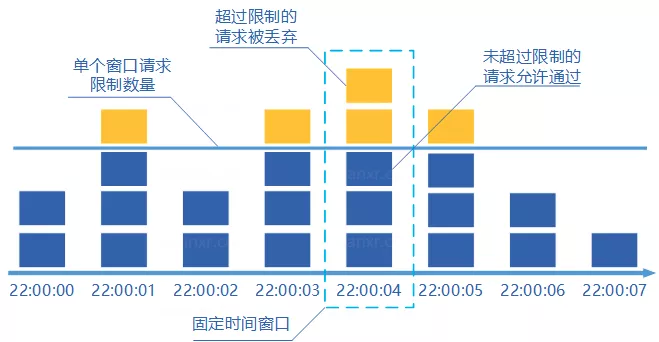
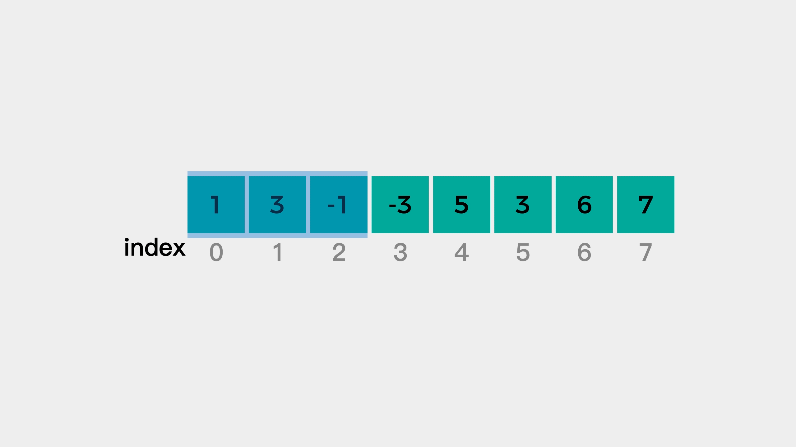
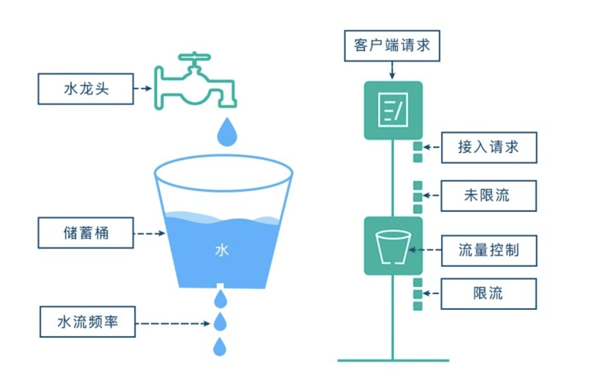
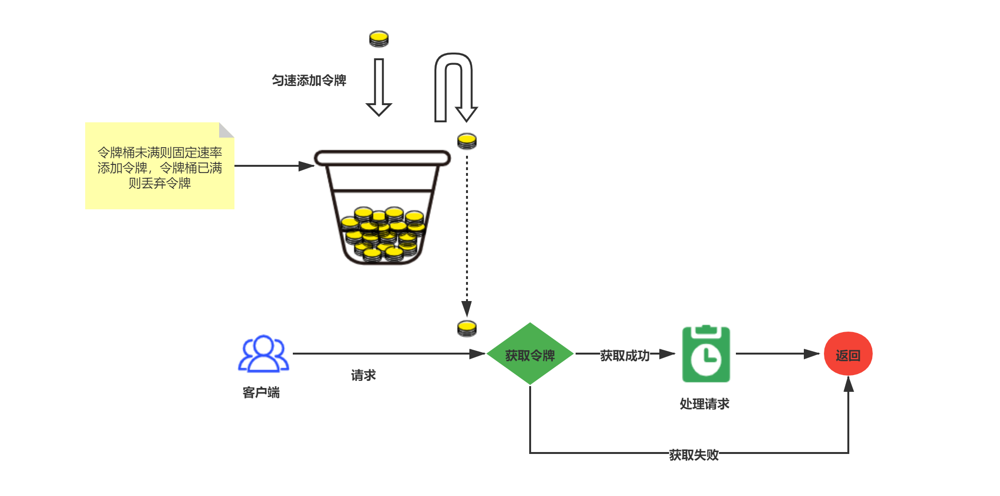

# 分布式限流器

> 基于 `Redis` + `Lua` 实现分布式限流，已实现 `固定窗口限流`（又称计数器）、`滑动窗口限流`、`漏桶限流`、`令牌桶限流` 四种机制，每个限流算法均有其特殊应用场景，请结合自身业务选择。

## 限流介绍

### 算法对比

| 算法类型 | 优点 | 缺点 | 适用场景 |
| :-- | :-- | :-- | :-- |
| 固定窗口 | • 实现简单<br>• 内存占用少<br>• 计算性能好 | • 临界点流量突增<br>• 窗口切换时可能流量翻倍<br>• 流量分布不均匀 | • 简单API限流<br>• QPS要求不高的场景<br>• 短时间窗口的限流 |
| 滑动窗口 | • 流量平滑<br>• 解决临界点问题<br>• 精确度高 | • 实现复杂<br>• 内存占用大<br>• 计算复杂度高 | • 需要精确控制流量的场景<br>• 对突发流量要求不高的接口<br>• 支付等关键业务 |
| 漏桶算法 | • 流量最平稳<br>• 系统稳定性好<br>• 保护下游服务 | • 不支持突发流量<br>• 处理效率较低<br>• 对小流量也限制 | • 消息队列消费<br>• 数据库写入<br>• 固定速率的场景 |
| 令牌桶算法 | • 支持突发流量<br>• 流量较均匀<br>• 灵活性强 | • 实现最复杂<br>• 参数调优难<br>• 令牌生成开销大 | • 秒杀系统<br>• 需要处理突发流量<br>• 对灵活性要求高的场景 |

### 算法说明
#### 1. 固定窗口限流
> 在固定窗口内对请求进行计数，然后与设置的最大请求数进行比较，如果超过了最大值，就进行限流。到达了一个固定时间窗口终点，将计数器清零，重新开始计数。



**缺点**

> 一般窗口设置在1s的时相对好些，但当窗口设置较大时就容易出现弊端。

- 流量分布：流量在窗口内分布不均匀，流量会被集中到某个时间点；
- 资源分布：在一个较大的窗口中，已经处理完请求的资源无法被更好的释放，从而被后面的请求使用；

#### 2. 滑动窗口限流

> 在计数器算法中，把大时间窗口在进一步划分为更细小的时间窗口格子，随着时间向前移动，大时间窗每次向前移动一个小格子，而不是大时间窗向前移动。每个小格子都有自己独立计数器，小格子会记录每个请求到达的时间点。



**缺点**

- 在瞬时流量单位（如，毫秒级）远小于滑动窗口小格子时，无法精细控制流量
- 实现更复杂，需要维护时间窗口，占用内存更多，计算时间复杂度也相应变大

#### 3. 漏桶限流

> 漏桶算法(Leaky Bucket)的主要思想是将请求比作水，水桶比作容器。水（请求）以任意速率流入水桶，而水桶以固定的速率漏水（处理请求）。当水超过桶的容量时，新的水进入桶时会被溢出（请求被拒绝）。



**关键点**

- 桶的容量是固定的，代表系统能够处理的请求总量
- 水（请求）可以以任意速率流入桶中
- 桶以固定速率漏水（处理请求）
- 当桶满时，新进入的水（请求）会被丢弃

**优点**

- 能够严格控制数据的传输速率，保护系统的稳定性
- 无论外部请求量多大，漏桶算法总是以固定的速率处理请求
- 具有"整流"作用，能够平滑突发流量

**缺点**

- 无法应对突发流量，即使系统有能力处理更多请求也会被限制在固定速率
- 在请求量明显小于漏水速率时，漏桶算法的处理效率偏低
- 相比令牌桶算法，缺乏流量调节的灵活性

**场景**

- API 调用限制
- 消息处理队列
- 数据库写入限制

**注解**

- 当请求速率小于漏水速率时，几乎所有请求都会通过
- 当请求速率大于漏水速率时，超出桶容量的请求会被拒绝
- 即使在突发流量下，也能保证处理速率不超过漏水速率
- 桶容量决定了系统能处理的突发流量大小

#### 4. 令牌桶限流

> 令牌桶(token burst)算法将令牌放入桶中，请求获取令牌成功才会往下走，否则丢弃掉该请求。令牌总数超过桶容量就丢弃。令牌(token)的生产速率可以根据流量灵活控制。桶的存在也使得算法对突发流量有一定的容忍能力。



**关键点**

- **<font color="red">限速速率不一定是匀速的，但长期速率是一定的</font>**；
- 请求是否可执行与令牌生成无关，与令牌桶中是否有可用令牌相关；
- 定时定量向令牌桶投入令牌，令牌桶有容量限制，容量满了则丢弃不再投入令牌;

**优点**

- 相对滑动窗口更节省内存
- 在限流的同时可以应对一定的突发流量
- 可以有效平滑流量，因为令牌桶的令牌是匀速放入的
- 解决了固定窗口流量尖峰的问题，确保在任意时刻，过去窗口时间内的请求不会超出阈值

## 如何使用

### 安装

```bash
go get -u github.com/BeCrafter/go-ratelimiter@latest
```

### 使用

#### 请求 `bootstrap` 目录中引入依赖

```go
import (
    "github.com/redis/go-redis/v9"
    // 引入限流Lib
    "github.com/BeCrafter/go-ratelimiter"
)

// XxxInit XxxInt 方法中增加代码
func XxxInit(ctx context.Context) {
    // Redis 资源初始化
    redisClient := redis.NewClient(&redis.Options{
        Addr:     "localhost:6379",
        Password: "", // no password set
        DB:       0,  // use default DB
    })

    // 限流器初始化
    ratelimiter.Init(redisClient)
}
```

#### 业务调用

```go
import (
    "github.com/BeCrafter/go-ratelimiter"
)

func Demo() {
    // 固定窗口限流
    obj := ratelimiter.NewRateLimiter("credit", ratelimiter.FixedWindowType)
    rr, err := obj.WithOption(ratelimiter.NewFixedWindowOption()).Do()

    // 滑动窗口限流
    obj2 := ratelimiter.NewRateLimiter("credit", ratelimiter.SlideWindowType)
    rr2, err2 := obj2.WithOption(ratelimiter.Options{
        LimitCount: int64(5),  // 限流大小
        TimeRange:  int64(20), // 窗口大小（内部会基于窗口大小动态调整小窗口大小）
    }).Do()

    // 令牌桶限流
    obj3 := ratelimiter.NewRateLimiter("credit", ratelimiter.TokenBucketType)
    rr3, err3 := obj3.WithOption(ratelimiter.Options{
        LimitCount: int64(5),  // 最大令牌桶个数
        TimeRange:  int64(20), // 限流时间间隔(即: 令牌生成周期)
    }).Do()

    // 漏桶限流
    obj3 := ratelimiter.NewRateLimiter("credit", ratelimiter.LeakyBucketType)
    rr3, err3 := obj3.WithOption(ratelimiter.Options{
        Capacity:  int64(20),  // 桶的容量
        LimitCount: int64(5),  // 漏水速率, 单位是每秒漏多少个请求
    }).Do()
}
```

#### 限流判断

```go
func Demo() {
    obj := ratelimiter.NewRateLimiter("credit", ratelimiter.FixedWindowType)
    rr, ok := obj.WithOption(ratelimiter.Options{
        LimitCount: int64(5), // 限流大小
        TimeRange:  int64(2), // 窗口大小
    }).Do()
    
    if err == nil && rr > 0 {
        // 请求可以继续执行
        .......
    }else{
        // 请求中断
        panic("hit limit")
    }
}
```

## 一些注意项

- 申请 Redis 集群时，版本需要在4.0以上;
- Lua 脚本会被分配到写库上执行，故申请资源时需要重点关注写库性能;
- Redis 集群注意项：
  * Q-1: 性能集群单片写入QPS为10000，如果是lua脚本的话，是否是同样的QPS？
  * A-1: 是的
  * Q-2: 单Key的QPS承受不高，如何实现拆Key并将其打散到不同分片？
  * A-2: Key 加后缀，会根据 hash 落在特定分片上，不同 Key 名的话，有可能落在同一个分片
  * Q-3: 以Lua脚本进行限流场景下，建议选取什么样的集群架构？
  * A-3: 申请高性能 Redis 集群，建议一主多从（使用 lua 的话，跨地域同步会有问题）
